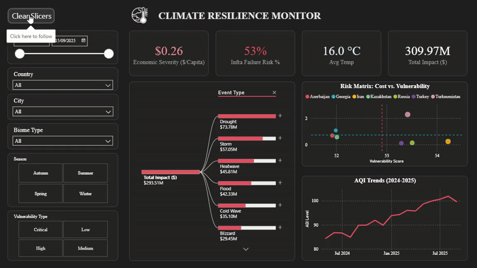

# 🌍 Climate Resilience Monitor: End-to-End Analytics Pipeline


*(view the [Static Image](Assets/Dashboard.png))*

> **Project Type:** Capstone – Data Engineering & Business Intelligence  
> **Tools:** SQL Server (SSMS), Power BI, Python (Data Simulation)  
> **Domain:** Environmental Risk & Economic Impact Analysis  
>
> 📄 **[Read the Full Project Report (Documentation)](Climate_Analytics_Capstone_Report.pdf)**

## 📋 Executive Summary
Regional governments face rising costs from climate disasters but often lack a unified view of risk. This project transforms raw daily climate logs from 7 countries into a **Strategic Decision Support System**. 

Unlike traditional weather reports that are **descriptive** (what happened?), this pipeline is **prescriptive** (where should we invest?). By normalizing cost data against infrastructure vulnerability, I identified specific "Critical Priority" cities, enabling stakeholders to shift budget allocation from reactive relief to proactive prevention.

## 🛠️ Tech Stack
*   **SQL Server:** Utilized for the full ETL lifecycle—Staging (Bulk Insert), Transformation (Data Cleaning/Type Casting), and Loading (Star Schema Design).
*   **Power BI:** Used for advanced analytics using DAX (Time Intelligence, Normalization Measures) and UI/UX design (Dark Mode for low-light monitoring).
*   **Python:** Utilized for synthetic data generation to simulate complex enterprise scenarios (inconsistencies, NULL handling, and high-volume logging).

---

## 🔍 The Business Problem
**The Challenge:** Climate data was fragmented across multiple CSV sources with inconsistent formatting, text-based numbers, and missing values.
**The Goal:** Build a centralized "Climate Resilience Monitor" to answer:
1.  Which cities are entering high-risk periods?
2.  Does infrastructure vulnerability correlate with higher economic loss?
3.  Where should emergency funds be allocated first?

## ⚙️ Methodology

### 1. Data Engineering (ETL)
*   **Staging:** Created a robust staging environment using `NVARCHAR` to ingest raw, messy data without breaking the pipeline.
*   **Cleaning:** Implemented SQL scripts to handle `NULL` values, trim whitespace, and cast columns to correct data types (`FLOAT`, `DATE`).
*   **Validation:** Automated data quality checks to remove duplicate `Record_IDs` and filter out incomplete records.

### 2. Data Modeling
*   Designed a **Star Schema** optimized for Power BI performance.
*   Created a dedicated **Date Table** for accurate time-series analysis.

### 3. Visualization & Logic
*   **Normalization:** Created a custom DAX measure for `Economic Severity ($/Capita)` to ensure small, vulnerable cities were not overshadowed by large metropolises.
*   **Risk Matrix:** Developed a scatter plot comparing *Vulnerability Score* vs. *Economic Impact* to visually identify high-priority investment targets.

---

## 📊 Key Insights

* **Droughts are the Primary Economic Drain:** Decomposition analysis reveals that **Droughts ($73.78M)** account for the highest total economic impact, surpassing Storms and Heatwaves.
* **High Infrastructure Risk:** The dashboard highlights a **53% Infrastructure Failure Risk**, indicating that over half of recorded extreme events occurred in areas with vulnerable infrastructure systems.
* **The "Critical Quadrant":** The Risk Matrix (Scatter Plot) identified specific cities in the **Top-Right Quadrant** (High Vulnerability + High Severity) that require immediate infrastructure reinforcement to prevent future losses.
* **Worsening Air Quality:** Time-series analysis shows a steady **upward trend in AQI** (rising from ~85 to ~100+ over the observed period), signaling a growing environmental health crisis alongside economic risks.
---

## 📂 Repository Structure

```text
├── 📁 Assets/                  # Dashboard Demo GIF, Backgrounds & Theme
├── 📁 Backup/                  # Database backup files
├── 📁 Data_analysis/           # SQL scripts for Analytical Queries
│   ├── 01_time_series_analysis.sql
│   ├── 02_spatial_analysis.sql
│   └── ... (Risk Analysis & Quality Checks)
├── 📁 Data_cleaning/           # SQL scripts for ETL & Cleaning
│   ├── 01_merge_country_tables.sql
│   ├── 02_check_nulls.sql
│   └── ... (Deduplication & Row Removal)
├── 📁 Datasets/                # Source Data
│   ├── Azerbaijan_climate_500.csv ... (and other country files)
│   └── data_generator.py       # Python logic used for data simulation
├── 00_setup_and_load.sql       # Main Setup Script (Schema Creation)
├── Climate_Analytics_Capstone_Report.pdf  # Full Project Documentation
└── dashboard.pbix              # Power BI Project File